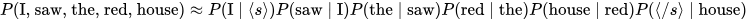
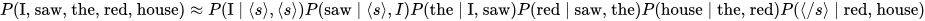

# Efficient Estimation of Word Representations in Vector Space

## Table of Contents

- [N-gram Model](#n-gram-model)
  - [Unigram Model](#unigram-model)
  - [Bigram Model](#bigram-model)
  - [Trigram Model](#trigram-model)
- [Notebooks](#notebooks)

---

## N-gram Model

The **N-gram model** is a probabilistic **language model** that predicts the likelihood of a word given its preceding words. It follows a **forward approach**, meaning it predicts the next word in a sequence but not previous words.  

Special tokens are often used to denote the start and end of sentences:  
`<s>` → start of sentence  
`</s>` → end of sentence  

Historically, the progression of language models has been:  

1. **Word-level N-gram models**  
2. **Recurrent Neural Networks (RNNs)**  
3. **Transformer-based models (Large Language Models)**  

---

### Types of N-gram Models

#### Unigram Model

- **Definition:** An N-gram model with `n = 1`.  
- **Key Idea:** Each word's probability is independent of previous words.  
- **Property:** The sum of all word probabilities in the corpus is 1.  

Example:  
If the corpus contains `["I", "saw", "the", "red", "house"]`, the unigram probability of `"I"` is computed independently of other words.  

---

#### Bigram Model

- **Definition:** An N-gram model with `n = 2`.  
- **Key Idea:** Probability of a word depends on the **previous word**.  
- **Example:** Sentence: `"I saw the red house"`  

  

---

#### Trigram Model

- **Definition:** An N-gram model with `n = 3`.  
- **Key Idea:** Probability of a word depends on the **two previous words**.  
- **Example:** Sentence: `"I saw the red house"`  

---

## Notebooks

You can explore practical implementations and experiments of N-gram models in the following notebooks:  

- [N-gram Model Notebook](../../../notebooks/N-gram-Model.ipynb)  
